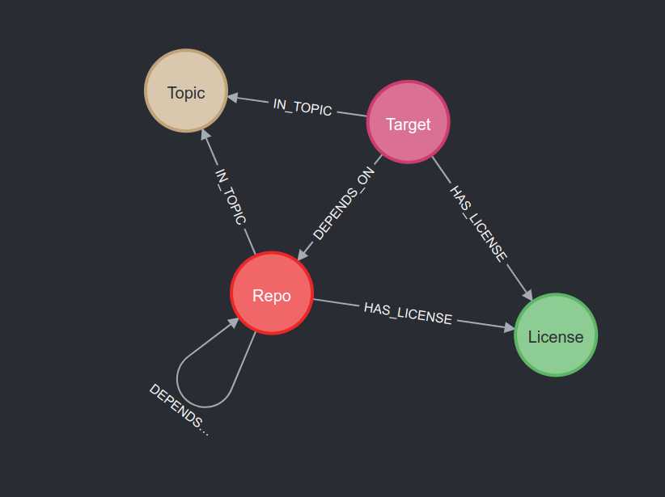
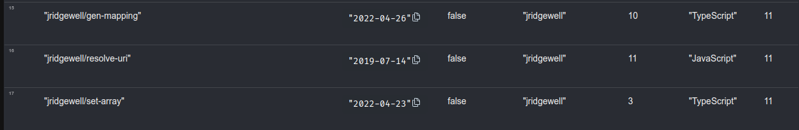
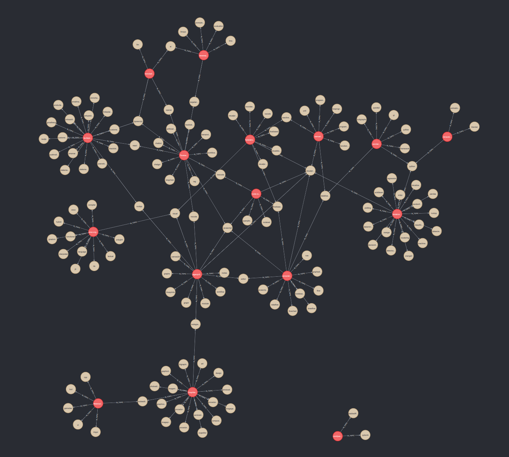

# Building Dependency Graph

## Preparing the Data

## Loading Data to Neo4j

### The Graph Model

The graph model currently used in database in `neo4j`.



#### Nodes

All of the repository information are get through GitHub API once we have their full name (ex: `data-exp-lab/deepgit`).

```python
from github import Github
g = GitHub()
repo = g.get_repo(full_name_or_id=repo_full_name)
```

##### Repo `(:Repo)`

Be really carefully about getting the descriptions.
Because Neo4j wraps strings with `"`, we need to replace every `"` to `'` in the description.

- Label: `Repo`
- Properties:
  - id: string (same as name)
  - name: string (ex: `jagenjo/litegraph.js`, `repo.full_name`)
  - starsCount: num (`repo.stargazers_count`)
  - forksCount: num (`repo.forks`)
  - watchersCount: num (`repo.subscribers_count`)
  - createdAt: datetime (`repo.created_at`)
  - description: string (`repo.description`)
  - githubPage: string (`repo.html_url`)
  - ownedByOrg: boolean (`repo.organization` is not None)
  - owner: string (`repo.owner` returns a `NamedUser` obj)
  - language: string (`repo.language`)

##### Target `(:Repo:Target)`

Target node has the exactly same properties as in repo node, except that their is a secondary label `:Target`.

##### Topic `(:Topic)`

Because the topic (tag) is self-defined and added by the owner, it can be anything. To have a unique type of topic node in the database, I remove the spaces and the "-" in the tag name.

- Label: `Topic`
- Properties:
  - id: string (`repo.topics` and remove spaces and "-")
  - name: string (`repo.topics` returns a list. same as id)


##### License `(:License)`

- Label: `License`
- Properties: 
  - id: string (`repo.license.spdx_id`)
  - name: string (`repo.license.name`)
  - url: string (`repo.license.url`)

#### Edges

##### DEPENDS_ON `[:DEPENDS_ON]`

Currently, the dependencies are all flat, which means most of them are not directly depending on it.

> [!NOTE]
> Need to remove all the edges `(:Repo:Target) - [:DEPENDS_ON]-> (:Repo)`, and then map their direct dependencies layer-by-layer again.

##### HAS_LICENSE `[:HAS_LICENSE]`

##### IN_TOPIC `[:IN_TOPIC]`

### Importing CSV Files to Neo4j

#### For Nodes

```sql
LOAD CSV WITH HEADERS FROM "file:///home/cindytsai/Documents/GitHub/deepgit/building-dependency-graph/csv/target_repos.csv" AS row
MERGE (r :Repo :Target {id: row.name})
ON CREATE SET r.name = row.name,
              r.starsCount = toInteger(row.starsCount),
              r.forksCount = toInteger(row.forksCount),
              r.watchersCount = toInteger(row.watchersCount),
              r.createdAt = date(row.createdAt),
              r.description = row.description,
              r.githubPage = row.githubPage,
              r.ownedByOrg = toBoolean(row.ownedByOrg),
              r.owner = row.owner,
              r.language = row.language
```

#### For Edges

```sql
LOAD CSV WITH HEADERS FROM "file:///home/cindytsai/Documents/GitHub/deepgit/building-dependency-graph/csv/has_license.csv" AS row
MATCH (r :Repo :Target {id: row.repo})
MATCH (l :License {id: row.license})
MERGE (r) - [:HAS_LICENSE] -> (l)
```

## Exploring and Some Interesting Things

### Sort By the Most Used Dependencies

```sql
MATCH (r :Repo) <- [:DEPENDS_ON] - (s :Repo:Target)
RETURN r.name AS name,
       r.createdAt AS createdAt,
       r.ownedByOrg AS ownedByOrg,
       r.owner AS owner,
       r.starsCount AS starCount,
       r.language AS language,
       count(r) AS count ORDER BY count DESC
```



> ![:NOTE]
> Some of the most used dependencies in those target examined repo have just a few stars, even though lots of projects use it.

### What Topics (Tags) Do Our Target Examined Repo Covered?

```sql
MATCH (n :Repo :Target ) - [f :IN_TOPIC] -> (t :Topic)
RETURN n, f, t
```



> ![:NOTE]
> Because tags are self-defined by the owner, they don't overlap with each other, even though they have similar usage and features.